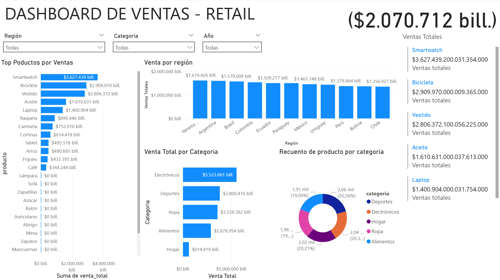

# Análisis de Marketing Bancario - Prueba Técnica

Repositorio que contiene el análisis completo de datos de marketing bancario para predecir la suscripción a depósitos a plazo fijo, desarrollado como parte del proceso de selección para el puesto de Consultor Líder Analítica.

## 📊 Presentaciones

### 1. Modelado Predictivo
[](1.%20Modelado%20predictivo%20y%20análisis%20de%20datos%20de%20campañas%20de%20marketing%20bancarias.pdf)

### 2. Estrategia Comercial
[](2.%20Estrategia%20Comercial%20para%20Maximizar%20Conversión%20y%20Minimizar%20Costos.pdf)

## 🏗️ Estructura del Proyecto

```
prueba tecnica datecsa/
├── soluciones/
│   ├── 1_analisis_datos/           # Análisis exploratorio y limpieza
│   │   ├── 1.1_limpieza_datos/     # Procesamiento inicial de datos
│   │   └── 1.2_analisis_descriptivo/ # Análisis estadístico descriptivo
│   │
│   ├── 2_modelos_predictivos/      # Modelos de machine learning
│   │   ├── 2.1_regresion_lineal/   # Modelo de regresión lineal
│   │   ├── 2.2_arbol_decision/     # Modelo de árbol de decisión
│   │   └── requirements.txt        # Dependencias para modelos
│   │
│   ├── 3_estrategia_liderazgo_analitica/  # Estrategia de implementación
│   ├── 4_visualizacion_datos/      # Dashboards y visualizaciones
│   └── 5_analisis_bancario/        # Análisis integral del caso bancario
│
├── src/                            # Código fuente principal
│   ├── __init__.py
│   └── main.py
│
├── .gitignore
├── bank-full.csv                   # Dataset principal
├── Prueba Tecnica Consultor Lider Analítica_2025.docx
└── requirements.txt
```

## 🚀 Requisitos

- Python 3.9+
- Git
- Jupyter Notebook (opcional, para visualizar los notebooks)

## ⚙️ Configuración

1. **Clonar el repositorio**
   ```bash
   git clone https://github.com/jaep321/prueba_tecnica_datecsa.git
   cd prueba_tecnica_datecsa
   ```

2. **Crear y activar entorno virtual**
   ```bash
   python -m venv venv
   # Windows
   .\venv\Scripts\activate
   # Linux/Mac
   source venv/bin/activate
   ```

3. **Instalar dependencias**
   ```bash
   pip install -r requirements.txt
   # Para desarrollo con modelos
   pip install -r soluciones/2_modelos_predictivos/requirements.txt
   ```

## 📚 Documentación

Cada directorio en `soluciones/` contiene su propio README.md con documentación detallada:

1. [Análisis de Datos](soluciones/1_analisis_datos/README.md)
2. [Modelos Predictivos](soluciones/2_modelos_predictivos/README.md)
3. [Estrategia de Liderazgo](soluciones/3_estrategia_liderazgo_analitica/README.md)
4. [Visualización de Datos](soluciones/4_visualizacion_datos/README.md)
5. [Análisis Integral](soluciones/5_analisis_bancario/README.md)

## 📊 Vista Previa del Dashboard



*Figura: Dashboard interactivo mostrando métricas clave del análisis de marketing bancario.*

## 📝 Notas Adicionales

- Los archivos PDF contienen presentaciones detalladas del análisis y estrategias.
- El dataset principal se encuentra en `bank-full.csv`.
- Se recomienda revisar los notebooks en orden numérico para seguir el flujo de análisis.
