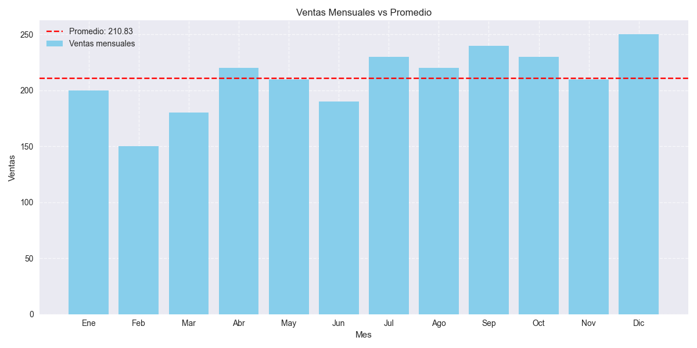

# 1.2 Análisis Descriptivo de Datos

## Descripción
Este directorio contiene un análisis descriptivo de las **ventas mensuales** según los datos definidos en el ejercicio.  
El análisis incluye cálculos estadísticos básicos y la generación de un gráfico comparando las ventas mensuales con el promedio anual.

## Estructura
- `analisis_descriptivo.py`: Script principal que realiza el análisis de ventas mensuales.
- `graficos/`: Directorio que contiene las visualizaciones generadas.
  - `ventas_mensuales.png`: Gráfico de ventas mensuales comparadas con el promedio.
- `README.md`: Este archivo con la documentación.

## Requisitos
- Python 3.8+
- pandas
- numpy
- matplotlib
- seaborn

## Instalación
1. Asegúrate de tener instalado Python 3.8 o superior.
2. Instala las dependencias necesarias:
   ```bash
   pip install pandas numpy matplotlib seaborn
   ```

## Uso
1. Ejecuta el script:
   ```bash
   python analisis_descriptivo.py
   ```
2. Los resultados se mostrarán en la consola y la visualización se guardará en el directorio `graficos/`.

## Análisis Realizado

### 1. Estadísticas Descriptivas
- **Promedio de ventas mensuales**: 210.83
- **Mediana de ventas mensuales**: 215.00
- **Desviación estándar**: 27.78

### 2. Visualización
- **Ventas mensuales vs promedio**:  
    
  Línea roja discontinua que indica el promedio general.

### Interpretación
El análisis muestra:
- Mes con mayores ventas: **Diciembre (250)**.
- Mes con menores ventas: **Febrero (150)**.
- Tendencia general de incremento de ventas a lo largo del año.
- Variabilidad moderada en ventas mensuales (desviación estándar de 27.78).
