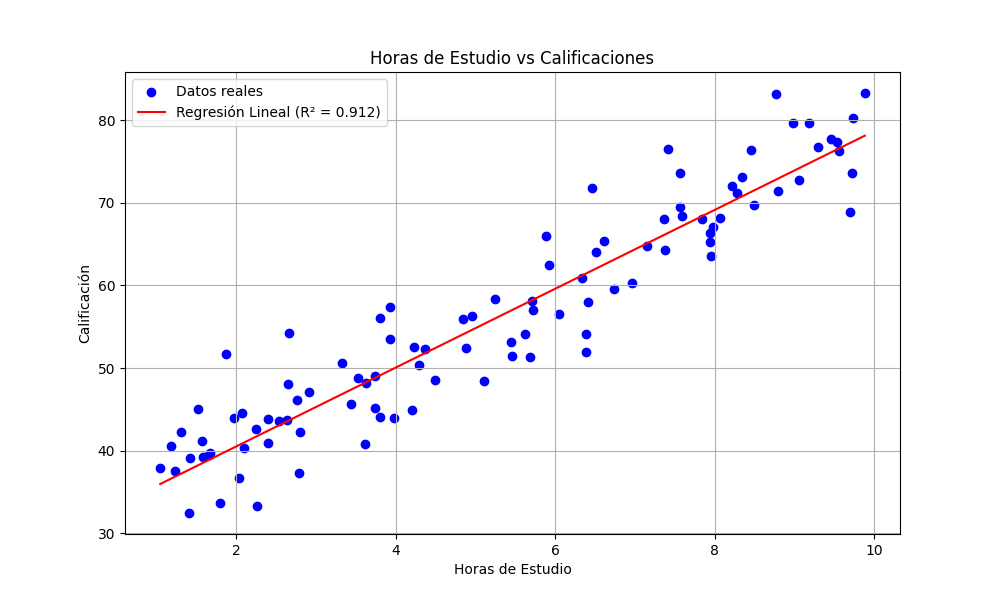

# Modelo de Regresión Lineal

Este directorio contiene la implementación de un modelo de regresión lineal que predice las calificaciones de los estudiantes en función de las horas de estudio.

## Descripción

El modelo de regresión lineal se utiliza para predecir la calificación que obtendrá un estudiante basándose en la cantidad de horas que ha estudiado. El modelo se entrena con datos de ejemplo y proporciona una predicción junto con métricas de rendimiento.

## Requisitos

- Python 3.6+
- Bibliotecas requeridas (instalables con `pip install -r requirements.txt`):
  - numpy
  - pandas
  - scikit-learn
  - matplotlib

## Uso

1. Ejecute el script `regresion_lineal.py`:
   ```
   python regresion_lineal.py
   ```

2. El script generará:
   - Estadísticas del modelo (coeficiente, intercepto, R²)
   - Una predicción para 5 horas de estudio
   - Un gráfico de dispersión con la línea de regresión guardado como `regresion_lineal.png`

## Resultados

Al ejecutar el script, verá el siguiente resultado:

```
Resultados del Modelo de Regresión Lineal
----------------------------------------
Coeficiente (pendiente): 4.96
Intercepto: 30.23
R² Score: 0.9783

Predicción para 5 horas de estudio: 55.03

Gráfico de regresión guardado como 'regresion_lineal.png'
```

### Interpretación de los Resultados

- **Coeficiente (4.96)**: Por cada hora adicional de estudio, se espera un aumento de aproximadamente 4.96 puntos en la calificación.
- **Intercepto (30.23)**: La calificación esperada cuando no se estudia (0 horas).
- **R² Score (0.978)**: El modelo explica aproximadamente el 97.8% de la variabilidad en las calificaciones, lo que indica un excelente ajuste a los datos.

### Gráfico de Regresión

El archivo `regresion_lineal.png` muestra:

1. **Puntos azules**: Representan los datos reales de horas de estudio vs calificaciones.
2. **Línea roja discontinua**: Muestra la línea de regresión lineal ajustada.
3. **Ejes etiquetados**: Eje X para horas de estudio y eje Y para calificaciones.
4. **Leyenda**: Incluye el valor R² para referencia rápida.



## Personalización

Para usar sus propios datos, modifique la función `generar_datos_ejemplo()` en el script para cargar sus datos. Asegúrese de que los datos estén en el formato correcto (horas de estudio como variable independiente, calificaciones como variable dependiente).

## Notas

- El modelo utiliza una división 80/20 para entrenamiento y prueba.
- Se utiliza una semilla aleatoria (random_state=42) para garantizar resultados reproducibles.
- El gráfico generado se guarda automáticamente en el mismo directorio que el script.
