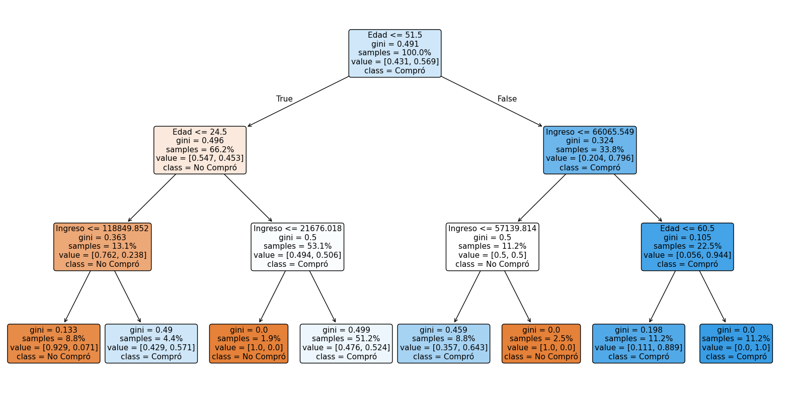

# Modelo de Árbol de Decisión

Este directorio contiene la implementación de un modelo de árbol de decisión que predice si un cliente realizará una compra basándose en su edad e ingreso anual.

## Descripción

El modelo de árbol de decisión clasifica a los clientes en dos categorías: aquellos que probablemente realizarán una compra y aquellos que no. El modelo analiza patrones en los datos de entrenamiento para tomar decisiones basadas en las características de edad e ingreso del cliente.

## Resultados del Modelo

Al ejecutar el script, se obtienen los siguientes resultados:

```
Resultados del Modelo de Árbol de Decisión
--------------------------------------------------
Precisión del modelo: 0.6500

Importancia de las características:
Edad: 0.4964
Ingreso: 0.5036

Predicción para nuevos clientes:
- Cliente de 30 años con ingreso de $40,000: Comprará
- Cliente de 50 años con ingreso de $100,000: Comprará
```

## Visualización del Árbol de Decisión

A continuación se muestra el árbol de decisión generado por el modelo:



### Interpretación del Árbol:

1. **Nodos de Decisión**:
   - Cada nodo muestra la característica y el umbral utilizado para dividir los datos.
   - Los valores `gini` indican la impureza del nodo (más cercano a 0 es mejor).
   - `samples` muestra el número de observaciones en cada nodo.
   - `value` muestra la distribución de las clases [No Compró, Compró].

2. **Hojas (Nodos Finales)**:
   - Muestran la clase predicha (No Compró/Compró).
   - El color indica la pureza del nodo (azul para "No Compró", naranja para "Compró").

## Cómo Usar el Modelo

1. Instale las dependencias:
   ```bash
   pip install -r requirements.txt
   ```

2. Ejecute el script:
   ```bash
   python arbol_decision.py
   ```

3. El script generará:
   - Las métricas del modelo
   - Predicciones para clientes de ejemplo
   - La visualización del árbol en `arbol_decision.png`

## Personalización

Para usar sus propios datos, modifique la función `generar_datos_cliente()` en el script para cargar su conjunto de datos. Asegúrese de que los datos incluyan al menos las columnas de edad, ingreso y la variable objetivo (compra: 1, no compra: 0).

## Notas Técnicas

- El modelo utiliza una profundidad máxima de 3 para evitar sobreajuste.
- La precisión del 65% indica que el modelo clasifica correctamente aproximadamente 2 de cada 3 clientes.
- La importancia de las características muestra que tanto la edad como el ingreso tienen una influencia similar en la predicción.
- Se utiliza una semilla aleatoria (`random_state=42`) para garantizar resultados reproducibles.
