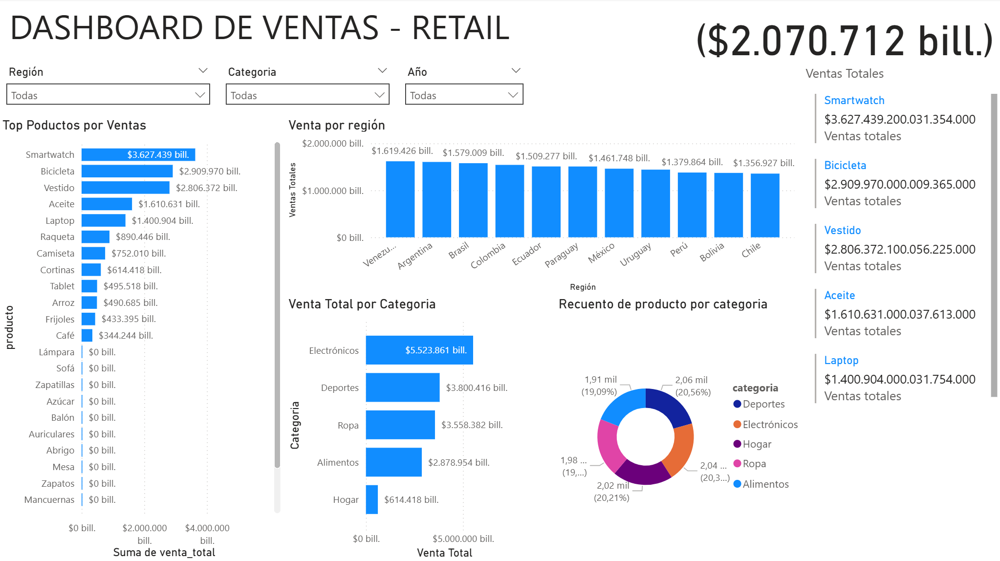

# 4. Visualización de Datos para Retail

## 4.1. Dashboard de Análisis de Ventas

### Estructura del Dashboard

#### 1. **Panel de Control Principal**
- **Filtros Globales** (ubicados en la parte superior):
  - Selector de período (últimos 30/60/90 días, YTD, año completo)
  - Filtro por región/tienda
  - Categoría de producto
  - Selector de año para comparación

#### 2. **Secciones del Dashboard**

**A. Encabezado Informativo**
- Título del dashboard
- Período seleccionado
- Indicadores KPI principales (ventas totales, margen promedio, crecimiento interanual)

**B. Mapa de Calor por Región**
- Mapa geográfico interactivo mostrando las ventas por región
- Código de colores: de rojo (bajo) a verde (alto)
- Al hacer clic en una región, se filtran los demás gráficos

**C. Gráfico de Barras Apiladas**
- **Eje X**: Meses del año
- **Barras apiladas**: Ventas por categoría de producto
- Línea de tendencia que muestra la variación interanual

**D. Tabla de Productos**
- Lista de productos ordenados por margen de ganancia
- Columnas: Nombre del producto, precio de venta, costo, unidades vendidas, margen bruto, margen porcentual
- Formato condicional para resaltar productos con mejor/menor rendimiento

**E. Gráfico de Líneas**
- Comparación de ventas mes a mes del año actual vs. año anterior
- Líneas diferenciadas por color
- Marcadores para puntos de datos
- Anotaciones para eventos especiales (promociones, feriados)

### Consideraciones de Diseño

1. **Jerarquía Visual**
   - KPIs principales en la parte superior con tipografía grande
   - Gráficos organizados por importancia de izquierda a derecha, de arriba a abajo
   - Uso consistente de colores en todo el dashboard

2. **Interactividad**
   - Capacidad de hacer clic en cualquier elemento para ver detalles
   - Tooltips informativos al pasar el cursor
   - Zoom en gráficos para análisis detallado

3. **Responsividad**
   - Diseño adaptable a diferentes tamaños de pantalla
   - Versión móvil con disposición vertical

4. **Accesibilidad**
   - Contraste adecuado para personas con discapacidad visual
   - Texto alternativo para imágenes
   - Opción de modo oscuro

### Captura de Pantalla del Dashboard

*Figura: Dashboard interactivo mostrando las métricas clave y visualizaciones del análisis de marketing bancario.*

### Herramientas Recomendadas

1. **Power BI**
   - Ideal para integración con Microsoft 365
   - Excelente para análisis de datos complejos
   - Gran variedad de visualizaciones personalizables

2. **Tableau**
   - Excelente rendimiento con grandes volúmenes de datos
   - Visualizaciones altamente personalizables
   - Fuerte comunidad y soporte

3. **Qlik Sense**
   - Motor de análisis asociativo
   - Buen rendimiento con datos en tiempo real
   - Interfaz intuitiva

### Próximos Pasos

1. Conectar a las fuentes de datos (ERP, CRM, bases de datos)
2. Crear el modelo de datos con las relaciones necesarias
3. Desarrollar las medidas y cálculos personalizados
4. Implementar las visualizaciones según el diseño propuesto
5. Realizar pruebas de usabilidad con usuarios finales
6. Capacitar a los usuarios en el uso del dashboard

### Consideraciones Técnicas

- Actualización automática de datos (diaria/horaria)
- Niveles de seguridad por perfil de usuario
- Histórico de datos para análisis de tendencias
- Sistema de alertas para métricas críticas
